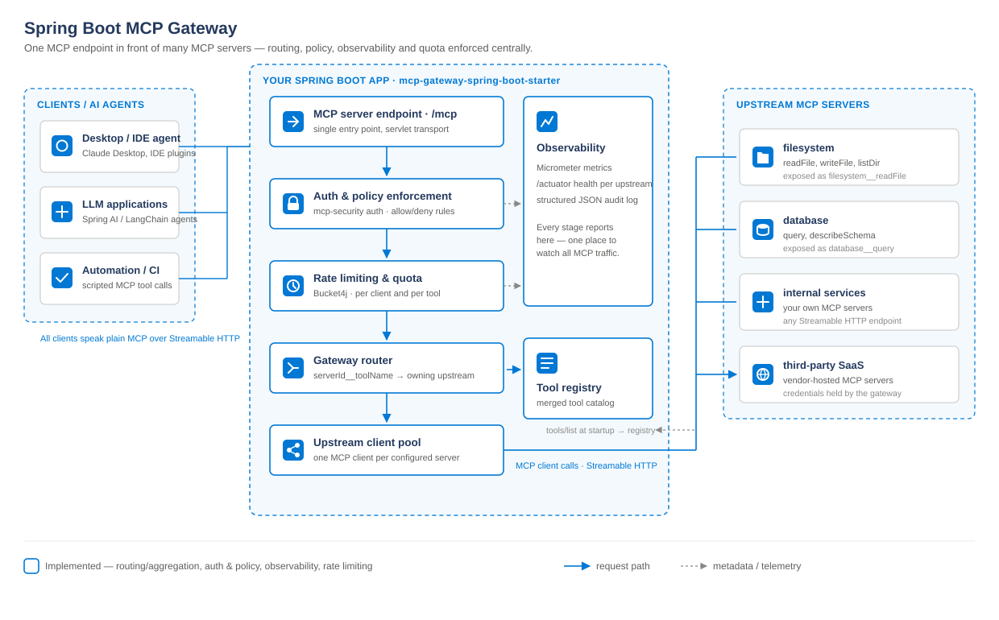

# Spring Boot MCP Gateway

**Enterprise MCP gateway for Spring Boot.** Put one governed endpoint in front of every MCP server your agents use — with authentication, tool-level authorization, quotas, audit and metrics enforced centrally instead of reimplemented in each server.

[](https://github.com/ashishgituser/springboot-mcp-gateway/actions/workflows/ci.yml)
[](https://github.com/ashishgituser/springboot-mcp-gateway/actions/workflows/docker.yml)
[](https://central.sonatype.com/artifact/io.github.ashishgituser/mcp-gateway-spring-boot-starter)
[](LICENSE)
[](https://openjdk.org/)
[](https://spring.io/projects/spring-boot)



## The problem

An organisation that adopts MCP ends up with MCP servers everywhere — one for the issue tracker, one for the warehouse, one per internal platform team. Every one of them then has to answer the same questions independently:

- Who is calling, and are they allowed to call *this* tool?
- How many calls per minute is that agent entitled to?
- What did it actually do, and can we prove it six months from now?

Answering those N times is how you get N different answers. Put the gateway at the boundary and you answer them once.

```
     Claude / Cursor / your agent
                 │
                 │  one MCP endpoint
                 ▼
      ┌──────────────────────┐
      │      MCP Gateway     │  identity → authorization → quota
      │                      │  → routing → audit + metrics
      └──────────┬───────────┘
        ┌────────┼────────┐
        ▼        ▼        ▼
      GitHub   Database  Internal
       MCP       MCP       MCP
```

## What makes it different

**Authorization-aware discovery.** Most gateways deny a call at execution time but still hand every caller the full tool catalog — which leaks the name, description and argument schema of every tool behind the gateway. Here `tools/list` runs through the same policy engine as `tools/call`, so a caller is only ever shown tools it could actually invoke. An analyst and an admin connecting to the same endpoint see different catalogs. ([how it is proved](#testing))

**Spring-native.** Not a sidecar, not another runtime to operate. It is a Spring Boot starter that binds `mcp.gateway.*` and integrates with the Spring Security context you already have, so roles come from your existing identity provider. If you would rather run it as its own service, the same thing ships as a container image.

**Survives its upstreams.** Sessions open lazily and are guarded by a circuit breaker, so one unreachable MCP server does not fail the gateway's startup or cost every caller a request timeout. Catalogs refresh on a schedule, so a server deployed after the gateway joins by itself.

## Quickstart

Needs nothing but Docker. Brings up a gateway in front of two MCP servers with deny-by-default policy and quotas on:

```bash
git clone https://github.com/ashishgituser/springboot-mcp-gateway
cd springboot-mcp-gateway
docker compose up --build
```

Point any MCP client at `http://localhost:8080/mcp`. What you should see:

| | |
|---|---|
| `tools/list` | returns `github__searchCode`, `github__createPullRequest`, `database__query` — and **not** `database__delete`, which the policy denies |
| calling `database__delete` | refused by the gateway; the database server never sees it |
| `/actuator/health` | reports `github` and `database` as separate upstreams |
| gateway logs | one structured JSON audit line per call, with the decision and the reason |

The policy lives in [deploy/compose/gateway.yml](deploy/compose/gateway.yml) — edit it and restart to watch the catalog change.

## Adding it to your application

```xml
<dependency>
  <groupId>io.github.ashishgituser</groupId>
  <artifactId>mcp-gateway-spring-boot-starter</artifactId>
  <version>0.2.0</version>
</dependency>
```

```yaml
mcp:
  gateway:
    servers:
      - id: github
        endpoint: http://github-mcp:8080/mcp
      - id: database
        endpoint: http://database-mcp:8080/mcp
```

That is a working gateway: both servers' tools are merged into one catalog, namespaced `<serverId>__<toolName>` so names never collide, and served on `/mcp`. Everything below is optional hardening on top.

For an unreleased commit, [JitPack](https://jitpack.io/#ashishgituser/springboot-mcp-gateway) builds any tag or commit on demand (`com.github.ashishgituser.springboot-mcp-gateway:mcp-gateway-spring-boot-starter:main-SNAPSHOT`).

## Running it as a service

Container images are published to GHCR for every push to `main` and every tag:

```bash
docker run -p 8080:8080 \
  -v ./gateway.yml:/app/config/application.yml:ro \
  ghcr.io/ashishgituser/mcp-gateway-server:latest
```

Every property also binds from the environment, so simple deployments need no config file at all. The image runs as a non-root user, shuts down gracefully, and exposes Actuator liveness/readiness probes.

## Configuration

### Authorization

Authentication is delegated to [mcp-security](https://github.com/spring-ai-community/mcp-security) — add `org.springaicommunity:mcp-server-security-spring-boot` and configure OAuth2 or API keys per its own docs. The gateway adds authorization on top.

```yaml
mcp:
  gateway:
    policy:
      enabled: true          # default false - until then every call is forwarded
      default-effect: DENY   # what happens when no rule matches
      filter-tool-list: true # default true - hide denied tools from tools/list
      rules:
        # First match wins, so narrow exceptions go above the broad rule they override.
        - effect: DENY
          tools: ["database__delete*"]
        - effect: ALLOW
          roles: ["admin"]
          tools: ["*"]
        - effect: ALLOW
          principals: ["ci-bot"]
          tools: ["github__createPullRequest"]
```

`principals`, `roles` and `tools` are each optional — an omitted constraint matches anything. `tools` entries are globs (`*`, `?`) over the namespaced name. Roles populate when Spring Security authenticates the caller; without it, callers resolve to the servlet principal with no roles, so role rules never match.

Set `filter-tool-list: false` if you publish your tool inventory elsewhere and want the full catalog visible with enforcement only at call time.

### Quotas

```yaml
mcp:
  gateway:
    rate-limit:
      enabled: true        # default false
      capacity: 100        # max tokens a bucket holds
      refill-tokens: 100
      refill-period: 1m
      scope: PRINCIPAL     # PRINCIPAL | TOOL | PRINCIPAL_AND_TOOL
      store: MEMORY        # MEMORY | REDIS
```

`store: MEMORY` (the default) keeps buckets in the gateway process, which means a deployment of N replicas hands out N times the configured quota. `store: REDIS` shares them — add `spring-boot-starter-data-redis`, point `spring.data.redis.*` at your Redis, and every replica draws from the same bucket. Refill and consume run as a single Lua script so two replicas cannot both spend the last token, and elapsed time comes from Redis's clock rather than each caller's.

### Observability

No configuration needed for any of it:

- **Metrics** — `mcp.gateway.tool.call` timer tagged with `tool.name` and `outcome` (`allowed`, `denied`, `rate_limited`, `not_found`, `error`), plus `mcp.gateway.tool.list` for discovery. Recorded through Micrometer's `ObservationRegistry`, so adding `spring-boot-starter-actuator` exports them and adding a tracing bridge produces spans from the same observations.
- **Health** — an `upstreams` indicator reporting `UP`/`DOWN` per configured server.
- **Audit** — one structured JSON line per call on the `io.github.ashishgituser.mcpgateway.audit` logger, so it can be routed to its own sink independently of application logs.

```yaml
mcp:
  gateway:
    audit:
      enabled: true
      include-arguments: false   # default false - see below
      redact: ["*password*", "*token*", "*secret*"]
```

Argument capture is off by default: arguments are where credentials and personal data live, and audit logs usually travel further than the gateway does. Turn it on and matching keys are masked (not dropped, so the log still shows the argument was there).

### Resilience

```yaml
mcp:
  gateway:
    refresh-interval: 60s   # 0 to freeze the catalog at whatever startup found
    request-timeout: 20s
    servers:
      - id: github
        endpoint: http://github-mcp:8080/mcp
        request-timeout: 10s
```

Three consecutive transport failures take an upstream out of rotation for 30 seconds; one probe then decides whether it is back. Protocol errors don't count — the server answered, so it is up.

## Compatibility

| | Supported | Notes |
|---|---|---|
| Spring Boot | 4.1.x | 3.x support is being investigated for 0.3 |
| Java | 17, 21 | both tested in CI |
| MCP SDK | 2.0.0 | |
| Client → gateway transport | Streamable HTTP | SSE and stdio not yet supported |
| Gateway → upstream transport | Streamable HTTP | |
| MCP primitives proxied | Tools | resources and prompts are not proxied yet |
| Rate limiting | In-memory or Redis | `mcp.gateway.rate-limit.store` |

## Modules

| Module | Purpose |
|---|---|
| `mcp-gateway-core` | Routing, policy, tool visibility, rate-limit SPI, audit model, upstream resilience. No Spring dependency. |
| `mcp-gateway-autoconfigure` | `@AutoConfiguration` and `mcp.gateway.*` binding. |
| `mcp-gateway-spring-boot-starter` | The dependency you add to your app. |
| `mcp-gateway-server` | Standalone container-ready distribution. |
| `mcp-gateway-sample` | Example application, and where the end-to-end tests live. |
| `mcp-gateway-demo-upstream` | Configurable MCP server backing the quickstart. |

## Testing

`mvn -B verify` runs three layers, on Java 17 and 21 in CI:

- **Unit tests** — router, policy engine, tool visibility, rate limiter, argument redaction, circuit breaker.
- **Architecture tests** (ArchUnit) — `mcp-gateway-core` may not reference Spring or Servlet classes; its policy/rate-limit/observability packages may not depend back on the router; autoconfiguration is constructor-wired, never field-injected.
- **End-to-end tests** — real MCP servers booted in-process, driven through the gateway's real HTTP endpoint by a real MCP client. They assert what the claims above depend on: that a denied tool is **absent from `tools/list`**, that a denied call never reaches the upstream (proved with upstream invocation counters, not response shape), that quota rejection happens before the upstream, and that a gateway boots and serves while one of its upstreams is dead, then folds it back in when it returns.

## Roadmap

- [x] Multi-server routing and tool aggregation
- [x] Auth & policy enforcement (on [mcp-security](https://github.com/spring-ai-community/mcp-security))
- [x] Observability: metrics, health, audit logging
- [x] Rate limiting (on [Bucket4j](https://bucket4j.com))
- [x] Authorization-aware tool discovery
- [x] Upstream circuit breaking and periodic catalog refresh
- [x] Audit argument capture with redaction
- [x] Container image and docker compose quickstart
- [x] Redis-backed distributed rate limiter
- [ ] Proxy MCP resources and prompts, not just tools
- [ ] Spring Boot 3.x compatibility
- [ ] Published latency benchmarks
- [ ] Helm chart

## Documentation

- [Architecture and request lifecycle](docs/architecture.md)
- [Security model and threat coverage](docs/security.md)
- [Releasing](docs/RELEASING.md)
- [Changelog](CHANGELOG.md)

## Contributing

See [CONTRIBUTING.md](CONTRIBUTING.md).

## License

[MIT](LICENSE)
